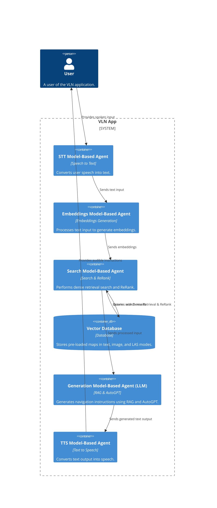
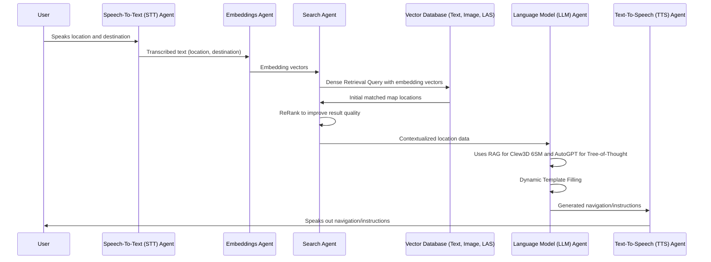

# VisionLLM App

Welcome to the VisionLLM App, an innovative application that leverages the power
of large language models (LLMs) and computer vision to provide an intuitive
interface for image-related tasks. This README provides detailed instructions on
setting up and installing the VisionLLM App.

## Setup/Installation Instructions

### Prerequisites

Before you begin, ensure you have administrative access to your computer and an
internet connection. You will need to install Python and Jupyter Notebooks to
use the VisionLLM App.

### Install Python

1. Download Python from the official
   [Python website](https://www.python.org/downloads/).
2. Choose the version appropriate for your operating system
   (Windows/Linux/MacOS).
3. Follow the installation instructions on the website.

### Install Jupyter Notebooks

After installing Python, you can install Jupyter Notebooks using the following
command in your terminal (Mac/Linux) or command prompt (Windows):

```bash
pip install notebook
```

### Create a Conda Environment

We recommend using a conda environment to manage the dependencies and packages
for the VisionLLM App.

#### Installation of Conda

- **Windows/Linux:**

  - Download the installer from
    [Miniconda](https://docs.conda.io/en/latest/miniconda.html) (a minimal
    installer for conda).
  - Follow the instructions provided in the installer.

- **MacOS:**
  - You can use the Homebrew package manager to install Miniconda with the
    following command:
    ```bash
    brew install --cask miniconda
    ```
  - Alternatively, download the MacOS installer from the
    [Miniconda website](https://docs.conda.io/en/latest/miniconda.html).

#### Creating the Environment

Once conda is installed, create a new environment named `visionllm` with the
following command:

```bash
conda create --name visionllm python=3.8
```

Activate the environment using:

```bash
conda activate visionllm
```

### Install Required Libraries

Within the `visionllm` environment, you will need to install several libraries.
Most can be installed via pip, but for PyTorch (`torch`), you'll need to follow
specific instructions based on your system's configuration.

#### Install PyTorch

PyTorch has various installation options depending on your system's CUDA version
and other factors. Please refer to the
[PyTorch Get Started](https://pytorch.org/get-started/locally/) page to find the
installation command that matches your configuration.

Select your preferences on the PyTorch Get Started page, and it will generate a
pip command for you to run. For example:

```bash
pip install torch torchvision torchaudio
```

#### Install Other Libraries

After installing PyTorch, you can proceed to install the other required
libraries using pip:

```bash
pip install openai langchain transformers[torch] timm
```

### Set Up Your OpenAI API Key

1. Go to [OpenAI API Keys](https://platform.openai.com/api-keys) and create your
   secret key. You will need to purchase API credits as well.
2. Set the API key as an environment variable within the `visionllm`
   environment:

   - **Windows:**

     ```bash
     setx OPENAI_API_KEY "your_api_key_here"
     ```

   - **MacOS/Linux:**
     ```bash
     export OPENAI_API_KEY="your_api_key_here"
     ```

   Replace `your_api_key_here` with the actual API key you obtained from OpenAI.

### Ensure Relative Path Structure

Make sure the directory structure of your program matches the expected paths in
the code. Place your images in a known directory relative to the Jupyter
Notebook. If you are attempting to use real-time stream functionality, setup
your system such that the captured frames are stored in the requisite folder on
the appropriate relative path.

### Running the Jupyter Notebook

With the base kernel set up, you can now run the Jupyter Notebook:

```bash
jupyter notebook
```

Navigate to the VisionLLM App notebook file and open it. The notebook should be
ready to run.

## Usage

Once you have set up everything, you can start using the VisionLLM App by
running the cells in the Jupyter Notebook. The app will guide you through
feeding your images and interacting with the LLM.

## Support

If you encounter any issues during the installation or usage of the VisionLLM
App, please open an issue on the GitHub repository with a detailed description
of the problem.

## System Architecture

A system architecture diagram has been provided to assist with debugging and application modification for specific use-cases.



## Skeletal Sequence Diagram for Multi-Agent, Multi-Modal VLN App


